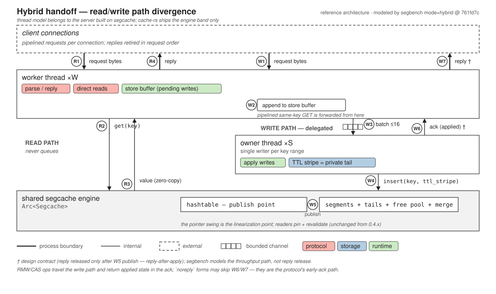

# Handoff: a reference thread architecture for write-heavy servers

**cache-rs owns no threads.** It ships a storage engine; every thread in this
document belongs to the server built on top of it. This page describes a
*reference* architecture — one way to arrange a server's threads around
`Arc<Segcache>` — and explains why the engine's existing publish protocol is
enough to make it correct. Nothing here is implemented in this repository.

It exists because of a measurement. On eight equal cores the shared engine
scales reads 8.19x and writes not at all: see
[the read/write scaling entry](journal/2026-08-25-segcache-read-write-scaling.md).
A server that is write-heavy and wants both properties has to stop treating
reads and writes the same way, and that is what this architecture does — reads
execute in place, writes are delegated to per-shard owner threads.

*Regenerate: `cargo run --release --bin handoff_diagram`. It asserts eight
claims against `benchmarks/segbench/src/main.rs` and aborts on drift, so the
chart cannot outlive the model it draws; the source commit is stamped on it.*

## The two promises

Cache protocols guarantee exactly two orderings, and nothing more:

1. **Program order per connection** — replies arrive in request order, and a
   connection observes its own effects (read-your-writes).
2. **A total order per key** — last-writer-wins must be well-defined.

Nothing is promised across connections or across keys. A handoff design only
has to preserve these two properties across the direct/delegated boundary.

## The publish point does most of the work

This is the part the engine supplies. In segcache 0.4.x a write becomes visible
at one atomic step: the item is fully defined out-of-place, then the hashtable
pointer swings, and readers pin the segment and revalidate. An owner thread is
simply *one particular writer* using that same protocol — so direct readers need
no new machinery and can never observe a torn value.

The entire divergence question reduces to managing the window between *acked to
the client* and *applied by the owner*, which is the server's problem, not the
engine's.

## Stage table (textual equivalent of the diagram)

| # | lane | action |
|---|------|--------|
| R1 | client → worker | request bytes (process boundary) |
| R2 | worker → engine | `get(key)` directly on the shared engine |
| R3 | engine → worker | value, zero-copy out of the pinned segment |
| R4 | worker → client | reply |
| W1 | client → worker | request bytes |
| W2 | worker | append to the connection's **store buffer** (pending writes) |
| W3 | worker → owner | batch of writes over a bounded channel (≤16/handoff) |
| W4 | owner → engine | `insert(key, value, ttl_stripe)` — per-owner tail |
| W5 | engine | hashtable pointer swing — **the linearization point** |
| W6 | owner → worker | ack: batch applied † |
| W7 | worker → client | reply † |

R2–R3 and W4–W5 are engine calls. Everything else is the server.

† design contract: the reply is released only after W5 (reply-after-apply).
The segbench harness models the throughput path (W1–W6), not reply release.

## Reply-after-apply

The write's reply — and therefore the connection's *next* request — waits for
the owner's ack. Consequences:

- The linearization point is the apply (W5): any read anywhere that starts
  after the client saw `STORED` also starts after the pointer swing.
- Per-key linearizability and read-your-writes fall out by construction.
- Cross-connection observers cannot distinguish an in-flight write from one
  that arrived a microsecond later at the socket.
- Cost: a connection's pipeline stalls one queue round-trip per write.

## The store buffer, with forwarding

The stall is avoidable without weakening any client-visible property. The
worker's pending-write set is exactly a CPU store buffer, and the same rules
apply:

- **Read of a different key** behind an outstanding write: execute directly,
  immediately. Program order constrains *reply* order, not execution order —
  retire replies in request order (a small reorder buffer) and the reordering
  is invisible.
- **Read of the same key**: serve it from the pending write —
  store-to-load forwarding. The client sees its own SET in its own GET.
- **RMW ops** (INCR, ADD, CAS, append): always delegated, always
  ack-after-apply — their return values *are* the applied state. CAS tokens
  compose: GETS reads the token directly; the owner validates at apply time; a
  racing write makes the CAS fail, which is correct.

The result is TSO-flavored: your own writes visible to you instantly, visible
to everyone else at the apply, one total order per key from the owner's queue.

## The early-ack shortcut, named honestly

Acking at enqueue buys write latency and costs bounded staleness across
connections (`STORED` becomes a promise about the future). Enumerating which ops
cannot take the shortcut — CAS, ADD, INCR, anything whose reply encodes applied
state — rebuilds the class system above, leaving fire-and-forget SETs as the only
beneficiaries. Memcached and RESP already express those explicitly (`noreply`,
`CLIENT REPLY OFF`): **protocol-visible ops ack after apply; the protocol's own
async forms are the early-ack path.**

## Loose ends

- **`flush_all` / epochs**: the admin plane drains owner queues (or epoch-stamps
  writes) so a flush cannot lose a race against in-flight writes it was supposed
  to precede.
- **Failure isolation**: a stalled owner is per-shard head-of-line blocking with
  per-shard backpressure — not the global collapse a fully shared structure
  gives.
- **No clocks anywhere**: ownership is the tie-breaker; the owner's queue order
  defines "last" per key. Timestamps (HLC) re-enter only when two appliers can
  touch one key — replication, shard migration — not here.

## What this would ask of the engine

Nothing, to be correct. The architecture works against segcache as it stands,
which is the point of the publish-protocol argument above.

To be *fast*, it wants the write-side follow-ups the scaling entry lists: per-TTL
tail striping and parallel reclaim. Owner threads with private TTL stripes get
some of the first one through the public API already, which is what `mode=stripe`
and `mode=hybrid` in the harness measure.
